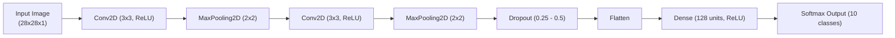

# Handwritten Digit Recognition with Convolutional Neural Networks

[](https://www.python.org/)
[-green.svg)]()
[-orange.svg)](http://yann.lecun.com/exdb/mnist/)
[](https://github.com/dheerajkumar2005)

---

## 📌 Overview

This repository provides an end-to-end **Convolutional Neural Network (CNN)** pipeline for classification of handwritten digits (0–9) on the standard **MNIST benchmark**.

The project investigates the impact of network depth, convolution filter sizes, spatial subsampling (max-pooling), and dropout regularization on training stability, test accuracy, and generalization capability.

---

## 🏗️ Architecture & Model Design



### Key Components:
* **Feature Extraction**: Stacked convolutional layers capturing hierarchical spatial features (low-level edges and corners progressing to stroke geometries).
* **Dimensionality Reduction**: Non-overlapping max-pooling layers enforcing spatial translation invariance.
* **Overfitting Prevention**: Dropout regularization to mitigate co-adaptation of hidden unit activations.
* **Diagnostics**: Loss convergence curves, per-class precision/recall, and confusion matrix error analysis.

---

## 🚀 Getting Started

```bash
git clone https://github.com/dheerajkumar2005/Handwritten-Digit-Recognition-CNN.git
cd Handwritten-Digit-Recognition-CNN

pip install numpy matplotlib seaborn jupyter scikit-learn tensorflow

jupyter notebook cnn-handwritten-digit-recognition.ipynb
```
